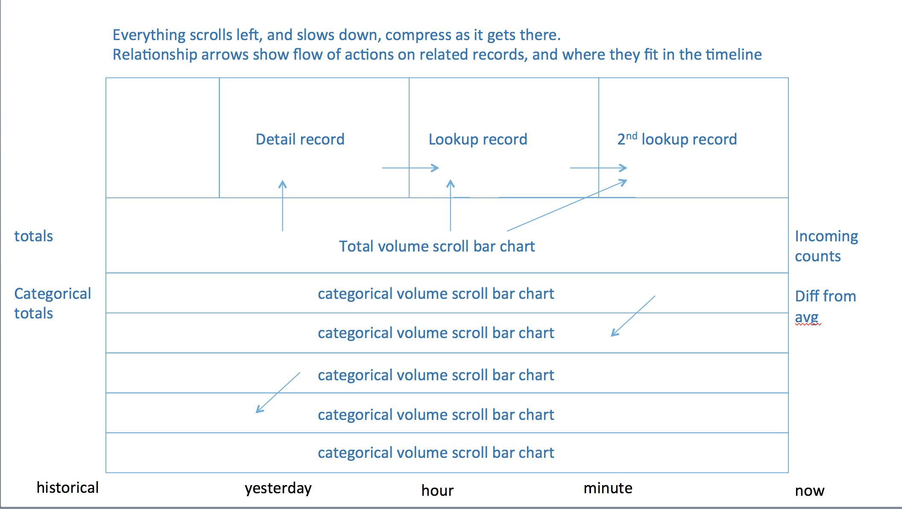

# visRelateBar
streaming visualization to show scrolling bars with relationships

The goal is to provide a streaming data visualization that shows a recent timeframe but keeps the context of historical data. It needs to be interactive but in a very light way, to have clickable components that can trigger outside functions. It will be showing summary data for thousands of records per second, and details on a few. the aggregation will be done outside the visualization. The logic on choosing what to show in detail is also decided outside the visualization.

## Requirements

- All Data must be in JSON format
- no external dependancies besides lodash and the webgl framework chosen

1. streaming horizontal bar with all of the features of sparkline
  1. with thresholds
  1. and customizable colors per data point
1. newer timeframes get more incremental space, historical is compressed
1. relationship lines stay anchored to the time they had the relationship.
  1. with customizeable colors
  1. and widths are relative to their weight
1. detail information can be displayed in syntax highlighted json format above and/or below the bar charts
  1. with relationship arrow shows where on the timline it came from
  1. any other information that is displayed but not related to the stream of data is clearly connected/related to the original data
1. numerical data aligned with each streaming bar that shows totals
1. Everything needs to have a mind towards performance, and be able to run for 24 hours without any serious memory leaks.

## Bar chart drawing logic

1 bar for each minute
when the chart is updated each second, it will show up to 60 seconds
there will never be more than 
24 1 hour bars
60 minute bars
60 second bars
each one will show avergae rate per second and can show less if there not enough room or data
priority if there's not enough room is to show all seconds, some minutes, fewer hours
seconds always higher priority / bar width / brighter than minutes and minutes higher priority than hours

